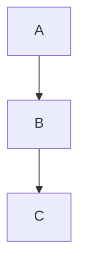

# 绘图工具

生成结构化图表（Mermaid）或自定义矢量图形（cli-anything-inkscape）。

## 工具选择

| 需求 | 工具 | 典型用例 |
|------|------|----------|
| 流程图、时序图、ER 图、甘特图、思维导图 | **Mermaid** | 研究流程、系统架构、数据关系 |
| 自定义矢量图、信息图、论文配图 | **cli-anything-inkscape** | 实验示意图、概念图、精排版图表 |

---

## 工具 1：Mermaid 结构化图表

### 支持的图表类型

- `flowchart` — 流程图（研究流程、算法步骤）
- `sequenceDiagram` — 时序图（系统交互、实验步骤）
- `erDiagram` — 实体关系图（数据库、数据结构）
- `gantt` — 甘特图（研究计划、项目时间线）
- `mindmap` — 思维导图（概念梳理、文献综述框架）
- `classDiagram` — 类图（软件架构）
- `pie` — 饼图（数据分布）
- `xychart-beta` — 折线/柱状图

### 使用方式

**方式 C：直接嵌入 Markdown（零依赖，首选）**

无需任何渲染工具，直接在 Markdown 中写：
````markdown

````
Claude Code 的预览会自动渲染。输出到 `.md` 文件时也可直接查看（GitHub/Obsidian 等均支持）。

**方式 D：mmdc 本地渲染为 PNG/SVG（需本地安装）**

```bash
# 安装（两步，缺一不可）：
npm install -g @mermaid-js/mermaid-cli
# 安装后还需安装 Chrome headless shell（在 mmdc 所在的 node_modules 目录下执行）：
cd $(npm root -g)/@mermaid-js/mermaid-cli
npx puppeteer browsers install chrome-headless-shell

# 生成图片
mmdc -i diagram.mmd -o workspace/figures/diagram.png
mmdc -i diagram.mmd -o workspace/figures/diagram.svg
```

通过 Python 调用 mmdc：
```python
import subprocess, tempfile
from pathlib import Path

mermaid_code = """
flowchart LR
    A[数据采集] --> B[预处理]
    B --> C{质量检查}
    C -->|通过| D[模型训练]
    C -->|失败| B
"""

with tempfile.NamedTemporaryFile(suffix=".mmd", mode="w", delete=False) as f:
    f.write(mermaid_code)
    mmd_path = f.name

out_path = "workspace/figures/pipeline.png"
Path(out_path).parent.mkdir(parents=True, exist_ok=True)
result = subprocess.run(["mmdc", "-i", mmd_path, "-o", out_path], capture_output=True, text=True)
if result.returncode != 0:
    print(result.stderr)
```

**方式 A/B：mermaid-py（需联网，仅有网络时可用）**

```bash
pip install mermaid-py
```

```python
from mermaid import Mermaid
from mermaid.graph import Graph

# 注意：mermaid-py 所有渲染方式（to_svg/to_png）均需通过 mermaid.ink 在线 API
# WSL2/代理环境下可能失败；无网络时请改用方式 C 或方式 D
graph = Graph('flowchart', "flowchart LR\n    A --> B\n    B --> C")
Mermaid(graph).to_png('workspace/diagram.png')
```

### 常用图表模板

**研究流程图：**
```
flowchart LR
    A[文献调研] --> B[问题定义]
    B --> C[方法设计]
    C --> D[实验实施]
    D --> E{结果分析}
    E -->|不满足| C
    E -->|满足| F[论文撰写]
```

**文献综述时间线：**
```
gantt
    title 研究时间线
    dateFormat YYYY
    section 早期工作
    基础理论建立 :2010, 5y
    section 方法发展
    深度学习引入 :2015, 3y
    section 近期进展
    Transformer 架构 :2018, 3y
    大模型时代 :2021, 3y
```

---

## 工具 2：cli-anything-inkscape 矢量图形

### 安装

```bash
pip install cli-anything-inkscape
```

### 重要：使用 Python API（推荐）

cli-anything-inkscape 是有状态的（in-memory session）——每次 CLI 调用都是独立进程，状态不会持久化。因此**必须在一个 Python 脚本中完成所有操作**，使用 Python API 直接调用：

```python
from pathlib import Path
from cli_anything.inkscape.core import (
    document as doc_mod,
    shapes as shape_mod,
    text as text_mod,
    styles as style_mod,
    export as export_mod,
)

SVG = Path("workspace/figures/diagram.svg")
SVG.parent.mkdir(parents=True, exist_ok=True)

# 1. 新建文档
proj = doc_mod.create_document(width=800, height=500, units='px', background='#ffffff')

# 2. 添加标题文字
text_mod.add_text(proj, text="实验架构示意图", x=400, y=40,
                  font_size=22, font_weight='bold', text_anchor='middle', fill='#1a1a2e')

# 3. 添加矩形并着色
# ⚠️ 重要：set_fill 使用整数索引（对象在 proj['objects'] 中的位置），不是字符串 ID
shape_mod.add_rect(proj, x=50, y=100, width=170, height=90, rx=8, ry=8)
idx = len(proj['objects']) - 1          # 当前对象的整数索引
style_mod.set_fill(proj, idx, '#4A90D9')

# 4. 矩形内添加文字
text_mod.add_text(proj, text="原始数据", x=135, y=148,
                  font_size=15, font_weight='bold', text_anchor='middle', fill='#ffffff')

# 5. 添加连接线
shape_mod.add_line(proj, x1=220, y1=145, x2=300, y2=145)
idx = len(proj['objects']) - 1
style_mod.set_stroke(proj, idx, '#555566', width=2.5)

# 6. 导出 SVG（必须显式调用 export，不会自动保存）
export_mod.export_svg(proj, str(SVG), overwrite=True)
print(f"已生成: {SVG}")
```

### 完整示例：三模块流程图

```python
from pathlib import Path
from cli_anything.inkscape.core import (
    document as doc_mod, shapes as shape_mod,
    text as text_mod, styles as style_mod, export as export_mod,
)

SVG = Path("workspace/figures/pipeline.svg")
SVG.parent.mkdir(parents=True, exist_ok=True)

proj = doc_mod.create_document(width=800, height=300, units='px', background='#f8f9fa')

# 模块配置
modules = [
    {"label": "数据输入", "sub": "Raw Input", "x": 50,  "color": "#4A90D9"},
    {"label": "处理模型", "sub": "Model",     "x": 315, "color": "#E8A838"},
    {"label": "输出结果", "sub": "Output",    "x": 580, "color": "#5BAD6F"},
]

for m in modules:
    shape_mod.add_rect(proj, x=m["x"], y=100, width=170, height=90, rx=8, ry=8)
    style_mod.set_fill(proj, len(proj['objects']) - 1, m["color"])
    text_mod.add_text(proj, text=m["label"], x=m["x"]+85, y=148,
                      font_size=15, font_weight='bold', text_anchor='middle', fill='#ffffff')
    text_mod.add_text(proj, text=m["sub"], x=m["x"]+85, y=168,
                      font_size=10, text_anchor='middle', fill='#e0e0e0')

# 连接箭头
for x1, x2 in [(220, 315), (485, 580)]:
    shape_mod.add_line(proj, x1=x1, y1=145, x2=x2, y2=145)
    style_mod.set_stroke(proj, len(proj['objects']) - 1, '#555566', width=2.5)

export_mod.export_svg(proj, str(SVG), overwrite=True)
print(f"已生成: {SVG} ({SVG.stat().st_size} bytes)")
```

### 支持的元素与 API

| 操作 | 函数 | 注意 |
|------|------|------|
| 新建文档 | `doc_mod.create_document(width, height, units, background)` | — |
| 矩形 | `shape_mod.add_rect(proj, x, y, width, height, rx, ry)` | — |
| 圆形 | `shape_mod.add_circle(proj, cx, cy, r)` | — |
| 直线 | `shape_mod.add_line(proj, x1, y1, x2, y2)` | — |
| 文字 | `text_mod.add_text(proj, text, x, y, font_size, font_weight, text_anchor, fill)` | — |
| 填充色 | `style_mod.set_fill(proj, idx, color)` | `idx` 为**整数**索引 |
| 描边 | `style_mod.set_stroke(proj, idx, color, width)` | `idx` 为**整数**索引 |
| 导出 SVG | `export_mod.export_svg(proj, path, overwrite=True)` | 必须显式调用 |

---

## 执行逻辑

1. **判断图表类型**：结构化/逻辑图 → Mermaid；精美配图/示意图 → cli-anything-inkscape

2. **选择 Mermaid 渲染方式**：
   - 默认：方式 C（嵌入 Markdown，零依赖，Claude Code 预览自动渲染）
   - 需要独立图片文件：方式 D（mmdc，需预先安装，两步安装见上）
   - 有网络且已安装 mermaid-py：方式 A/B（调用 mermaid.ink 在线 API）

3. **生成代码**：根据用户描述生成 Mermaid 代码或完整 Python 脚本

4. **输出到 workspace/**：
   ```
   workspace/
   └── figures/
       ├── diagram.svg
       ├── diagram.png
       └── experiment_setup.svg
   ```

5. **提示用户**：告知输出路径和嵌入方式（``）

## 示例

用户说："画一个我的研究流程图"
→ 生成 Mermaid flowchart，输出到 `workspace/figures/research_flow.svg`

用户说："帮我画一个实验装置示意图"
→ 用 cli-anything-inkscape Python API 在单脚本中完成，保存 SVG

用户说："画一个过去10年该领域的发展时间线"
→ 生成 Mermaid gantt 图，包含关键论文/方法里程碑

用户说："把这个 Mermaid 代码渲染成图片"
→ 优先用 mmdc（方式 D）本地渲染为 PNG/SVG；mmdc 未安装则输出 Markdown 嵌入（方式 C）
